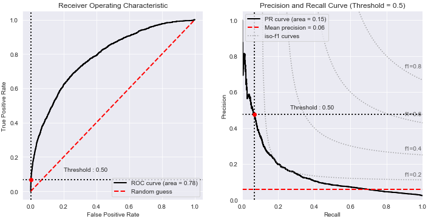

# Early Prediction of Sepsis from Clinical Data
This is a group project for DS-GA 3001 Probabilistic Time Series based on the PhysioNet Computing in Cardiology Challenge 2019 (https://physionet.org/content/challenge-2019/1.0.0/)

## Introduction
Sepsis is a life-threatening condition that occurs when the body’s response to infection causes tissue
damage,organ failure, or death. About 30 millions people develop sepsis and one-fifth of them die
from the disease every year around the world. Detecting sepsis early and starting immediate treatment
often save patients lives.

## Project Goal
The goal of this project is to early detect sepsis (6 hours ahead) using physiological data. The inputs are patients' information, including vital signs, laboratory values and demographics. The output is the results whether the model predicts non-Sepsis patients or Sepsis patients six hours ahead of clinical onset time.

## Dataset
For this study, we use clinical data of ICU patients from two separate hospital systems provided by the PhysioNet Computing in Cardiology Challenge 2019. The data for each patient are saved in a single pipe-delimited text file that has a fixed header. Each row of a patient file represents a single hour's worth for all the measurements within that ICU-hour stay. These measurements include vital signs, laboratory, and demographics values of 40 time-dependent variables. Nan indicates that the measurement is missing at this time interval. In total, we used over 20,000 patient files. After concatenating ICU-hour-stay entries from all the patients, we have about 800,000 lines of data in total.

According to the Challenge, labels in the dataset already take the goal of predicting Sepsis six hours in advance into account. The label for each hour of patient data is 1 (Sepsis onset positive) or 0 (Sepsis onset negative). Summarized from the labels, we have a very imbalanced dataset that has only 2.2 percent of Sepsis patients.

## Models
As large amount of missing data is our biggest issue in preprocessing, we have imputation models and classification model. RNN is an integrated model that can impute and classify at once. It indicates missing values using a mask that has the same shape as the data.
* Imputation models:
  * Interpolation
  * Linear Dynamical System (LDS)
* Classification models:
  * Logistic regression
  * Principle Component Analsis (PCA) and LR
  * Random Forest (RF)

## Code
Our code are in two folders: `data_preprocessing` and `models`.
* Data_preprocessing
  * `Analyzing_data.ipynb`:
  * `raw_data_split.ipynb`:
  * `missing_vals_baseline.ipynb`:
  * `missing_vals_LDS.ipynb`:
* Models
  
  Baseline:
  * `baseline_model_LR.ipynb`:
  * `baseline_model_PCA_LR.ipynb`:
  * `baseline_RF.ipynb`:
  
  LDS Imputed:
  * `LDS_model_LR.ipynb`:
  * `LDS_model_PCA_LR.ipynb`:
  * `LDS_RF.ipynb`:
  * `baseline_LDS_other_classifiers.ipynb`:

## Results
RNN that combines imputation and classification functions, implements a fixed sliding window on each patient, better catching and summarizing the time dependency. It achieved the best AUC of 0.82 and precision of 0.21, outperforming any other models.  

  

